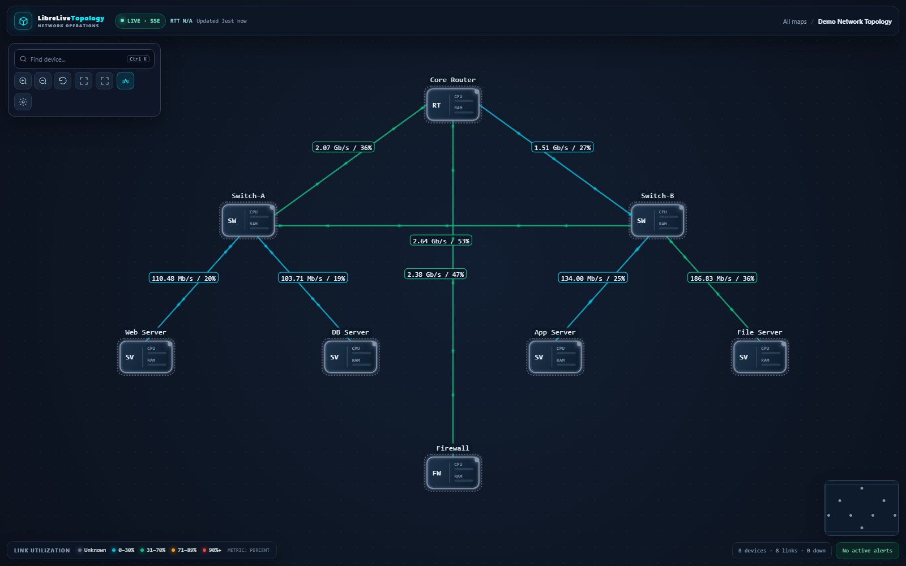
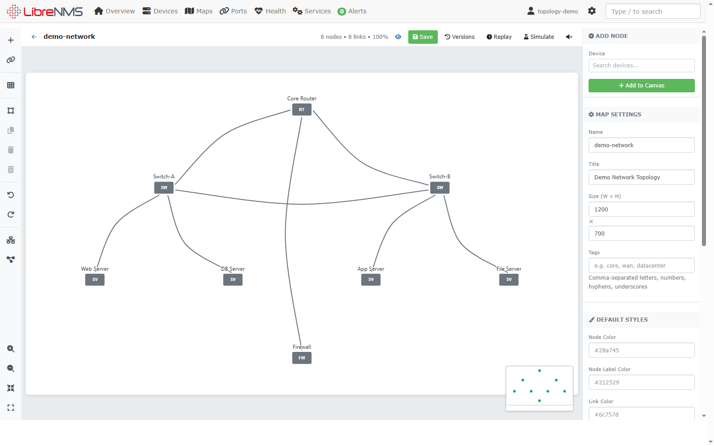
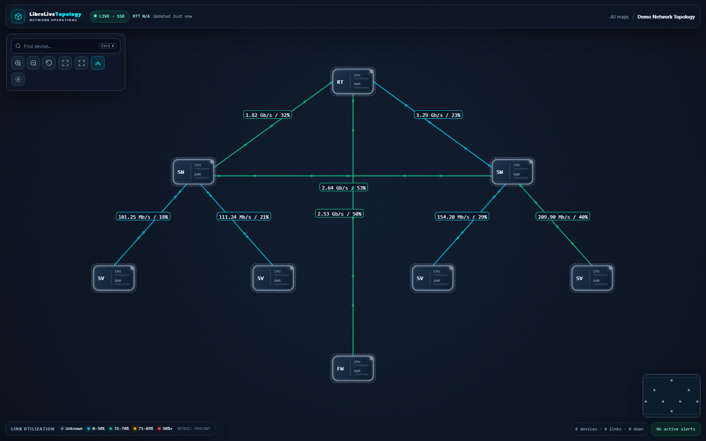

# LibreLiveTopology

**Interactive network topology and traffic maps for LibreNMS.**

LibreLiveTopology helps you design network maps, follow link utilization, and display your infrastructure on a dashboard or NOC wall. It runs inside LibreNMS and uses its devices, ports, neighbor discovery, and RRD traffic data.


## Screenshots

Screenshots below use a local LibreNMS development instance with simulated demo traffic.

### Network overview



### Map editor



### Dashboard view



## Features

- **Visual map editor:** drag devices, connect ports, route links with waypoints, snap to a grid, and undo changes.
- **Traffic visualization:** directional traffic, utilization colors, animated links, and RRD graph inspection.
- **Topology layout:** automatic placement, port-aware routing, zoom, pan, and a minimap.
- **LibreNMS integration:** device and port lookup, LLDP/CDP discovery, device status, and alert integration.
- **Map management:** templates, tags, JSON import/export, snapshots, and version history.
- **Dashboard display:** embedded maps, fullscreen kiosk mode, map cycling, and light/dark themes.
- **Access control:** authenticated viewing and administrator-only editing.

## Requirements

- A working LibreNMS installation with MySQL/MariaDB.
- PHP 8.2 or newer, Composer, and the `gd`, `json`, and `mbstring` extensions.
- Read access to LibreNMS RRD files for actual traffic measurements.

Install the plugin as **LibreLiveTopology**. Its Composer package is `librenms/librelivetopology`, and its routes start at `/plugin/LibreLiveTopology`.

## Install in LibreNMS

Clone this repository into the plugin directory. Replace `<repository-url>` with the clone URL of your LibreLiveTopology repository.

```bash
cd /opt/librenms/html/plugins
git clone <repository-url> LibreLiveTopology
sudo chown -R librenms:librenms /opt/librenms/html/plugins/LibreLiveTopology
sudo -u librenms -H bash -lc 'cd /opt/librenms/html/plugins/LibreLiveTopology && bash quick-install.sh'
```

The installer installs dependencies, registers the plugin, creates its database tables, and enables it. Open `/plugin/LibreLiveTopology` in your LibreNMS instance, create a map, add devices and links, and save.

See [Installation](INSTALL.md) for Docker integration and troubleshooting.

## Run locally with Docker

The development stack includes LibreNMS, MariaDB, and Redis. Its database credentials and simulated traffic are for local development.

```bash
docker compose -p librelivetopology -f docker-compose.dev.yml up -d db redis librenms
docker compose -p librelivetopology -f docker-compose.dev.yml logs -f librenms
```

Wait for LibreNMS initialization, then follow [the local setup guide](docs/LOCAL_DEVELOPMENT.md) to register the plugin, create an administrator, and seed the demo map. Open [localhost:8000](http://localhost:8000).

Stop the stack while keeping its database:

```bash
docker compose -p librelivetopology -f docker-compose.dev.yml stop
```

## Embed a map

```html
<iframe
  src="https://your-librenms/plugin/LibreLiveTopology/embed/1"
  title="Network topology"
  width="1200"
  height="700"
  style="border: 0"
></iframe>
```

The viewer requires a LibreNMS login. See [Embed Viewer Guide](docs/EMBED.md) for display options, polling, and kiosk mode.

## Troubleshooting

If the plugin routes are missing, register the package from the LibreNMS root:

```bash
cd /opt/librenms
composer config repositories.librelivetopology '{"type":"path","url":"html/plugins/LibreLiveTopology","options":{"symlink":true}}'
FORCE=1 composer require 'librenms/librelivetopology:*' --with-dependencies --no-interaction
php artisan package:discover
php artisan optimize:clear
php artisan route:list | grep -iE 'librelivetopology|llt'
```

For missing traffic, check device/port associations and RRD permissions. Demo mode produces simulated values; disable `LIBRELIVETOPOLOGY_DEMO_MODE` when connecting real monitoring data. The plugin's Diagnostics page provides additional installation checks.

If the plugin has duplicate registration rows, rerun the installer. LibreNMS validation may report plugin tables as extra tables; keep them. `utf8mb4_bin` warnings on JSON columns (`llt_map_templates.config`, `llt_nodes.meta`, `llt_maps.options`, and `llt_links.style`) are expected for the current schema.

This repository targets a fresh installation. Existing WeathermapNG databases and exported maps require a separate migration; the new plugin uses its own `llt_*` tables and identifiers.

## Development

```bash
# JavaScript behavior and layout tests (Node.js 22+)
node --test tests/*.test.cjs

# PHP package tests
composer install
vendor/bin/phpunit
```

See [Contributing](CONTRIBUTING.md) and [Local development](docs/LOCAL_DEVELOPMENT.md). CI checks JavaScript behavior, PHP syntax, package tests, and documentation.

## Documentation

- [Installation](INSTALL.md)
- [Local development and screenshots](docs/LOCAL_DEVELOPMENT.md)
- [Publishing as a new repository](docs/PUBLISHING.md)
- [Deployment](DEPLOYMENT.md)
- [API reference](API.md)
- [Embed viewer](docs/EMBED.md)
- [Performance notes](PERFORMANCE.md)
- [Changelog](CHANGELOG.md)

## Credits and license

LibreLiveTopology builds on WeathermapNG by lance0 and contributors. The original copyright notice is preserved in [LICENSE](LICENSE). Historical changelog entries describe the inherited codebase.

Released under the MIT license.
